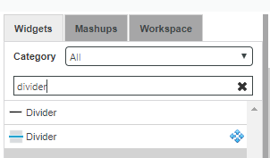
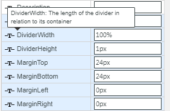
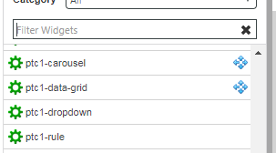
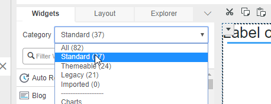

# Wrapping process

Web components need to be packaged as widgets so that they can be used or imported to TWX Composer. The *mub* is a wrapper tool to streamline that process. During web component wrapping you can:

* Expose properties
* Declare additional Mashup related properties
* Create a responsive widget (that expands to fill a responsive container)
* Assign a custom display name to the widget (instead of a named derived from the web component tag name)
* Declare custom code to be included with the widget (behavior/styling in the IDE and runtime)
* Assign a custom widget icon

## Public Properties and Default Wrapping
* Public (name is not starting with '_') properties of the web component can be exposed as widget properties.
* Name of widget property is a PascalCase name of WC property (`"defaultColor"` --> `"DefaultColor"`).
* Widget property is binding target if not read-only or computed. If property is output-bindable (`notify: true` or `computed`) in WC it's binding source in widget.
* Property is editable if not read-only and has a type of "String", "Number" or "Boolean".
* Component should trigger "_property-name_-changed" (`notify: true`) for property to be output-bindable.
* Property-change event is generated for each output-bindable property.
* Event name is a PascalCase property name with a "Changed" suffix (`"defaultColor"` --> `"DefaultColorChanged"`).
* `baseType` is derived from `type`
* `defaultValue` = `value`
* Default wrapping behavior could be modified by *widgets.json* configuration.

### Choosing Suitable Property Names

Some properties in TWX Composer are pre-defined. In a *static* container, you will get numeric properties `Height` and `Width` displayed, but not in a *responsive* container. If you were to declare public properties by same name as pre-defined properties in the component  (or explictly in `widgets.json`), they will clash with Composer's built-in handling and only be displayed where Composer *thinks* they should be showed.

## widgets.json
_widgets.json_ __*must present*__ in _<your_working_folder>/input_. Here you specify widgets and/or webcomponents that will be wrapped.

Here is an example file:

```json
{
  "description": "Simple el extension",
  "extensionName": "simple-el-widget",
  "version": "9.2.2",
  "htmlImports": [
    {
      "from": "npm",
      "id": "some-general-library",
      "version": "^1.0.0",
      "url": "some-general-library/some-general-library.js"
    }
  ],
  "components": [
    "import!simple-el.json"
  ]
}
```

### description, author, documentation:
Describes this file

### extensionName (only for _extension mode_)
The name of the TWX extension

### version:
In _extension mode_ it is the version of the TWX extension to create, affects the name of the zip file it generates when you run gulp.

In _package mode_ the version of the ptcs-widgets package is defined in the following way: If *SHELL_VERSION* environment variable is defined then package version is taken from here. If this variable is not defined package version is taken from the latest git version tag. If the tag also is not available extension number is taken from widgets.json.

### **htmlImports**:
A list of general dependencies which are required for all widgets in your package/extension.
* In _package mode_ will be downloaded to "webapps/common/lib".
* In _extension mode_ will be downloaded to "webapps/common".

Each item could have next properties:

* **from**:
  the only option is "npm"

* **id**:
  A unique ID for this dependency in the corresponding registry.

* **version**:
  Search for a "^{version}" of this dependency in the corresponding registry.

* **url**:
  The relative JS URL path to the dependency to be included into mashup

### **components**
References to files describing the widgets in _input/widgets/_

## input/widgets/
You put here json files with the description of your widgets. Here is an example _simple-el.json_:

```json
{
  "elementName": "simple-el",
  "htmlImports": [
    {
      "from": "npm",
      "id": "simple-el",
      "version": "^1.0.0",
      "url": "simple-el/simple-el.js"
    }
  ],
  "flags": {
    "name": "Simple El",
    "description": "Simple El description"
  },
  "properties": {
    "CustomClass": {
      "baseType": "STRING",
      "description": "Custom class for the element",
      "isBindingSource": true
    },
    "Prop1": {
        "baseType": "STRING",
        "isBindingTarget": true,
        "isBindingSource": false,
        "defaultValue": "Simple-El",
        "description": "Prop1 property"
    },
    "Prop2Property": {
        "baseType": "STRING",
        "isBindingTarget": true,
        "isBindingSource": false,
        "description": "Prop2 property",
        "src": "prop2"
    },
    "Data": {
      "src": "items",
      "baseType": "INFOTABLE",
      "description": "Data from data service",
      "isBindingTarget": true,
      "isEditable": false,
      "warnIfNotBoundAsTarget": true
    },
    "DisplayField": {
      "src": "selector",
      "isEditable": true,
      "isBindingTarget": false,
      "baseType": "FIELDNAME",
      "description": "What to display",
      "sourcePropertyName": "Data"
    }
  },
  "events": {
    "Clicked": {
      "src": "click"
    }
  },
  "services": {
    "TriggerFoo": {
      "warnIfNotBound": false,
      "description": "Foo service"
    }
  }
}
```

* **elementName**:
  Tag of the custom element. The widget name will be the tag name with no dashes and lower case.

* **htmlImports**:
  A list of all the html imports required for this widget. Note that dependencies for an entire
  extension are downloaded into one place. See [widgets.json->htlmImports](#htmlImports) for more details.

* **flags**:
  A JSON literal representing options supported by Mashup builder widget (ex. `"supportsLabel": true`).

* **exposeWCPropertiesAndEvents**:
  A boolean that allows to expose public web component properties/events to a widget. _false_ by default.

* **properties**:
  A JSON literal representing additional/modified widget properties in Mashup builder format. This will be merged
  with an automatically generated list of properties (see _Default wrapping_ section).
  "false" property value removes the property - useful to remove the wc properties automatically exposed by the wrapper.
  Additional property fields supported are:
  - **src**:
    Name of corresponding WC property.
  - **slot**:
    Name of shadow DOM slot to map property content to. Use "" as a name of default slot.
  - **slotElement**:
    For slot-mapped property - element to enclose property content.
  - **srcCssProperty**:
    Name of CSS custom property to map property content to.
  - **selected**, **selectedIndexes**:
    For property of `INFOTABLE` type - name of WC property holding an array of selected rows or row indexes.
  - **generatedFrom**:
    Name of defining widget property. The property value would be generated out of DataShape of infotable bound to defining property.
    (Used to generate content templates for data container widgets)
  - **generator**:
    For generated property - name of generator method. Defaults to "defaultGenerator".
    defaultGenerator generates html fragment of form:

  ```html
    <wrappingElement class="widgetid-line">
      <span class="widgetid-field widgetid-field-field1">{{item.field1}}</span>
      <span class="widgetid-field widgetid-field-field2">{{item.field2}}</span>
    </wrappingElement>
  ```

  - **wrappingElement**:
    For generated property using defaultGenerator - element to enclose item content
  - **canBeReset**:
    In conjuction with flag `"supportsResetInputToDefault": true` it defines that this property should be reset to the default value if the "Reset Input to Default" service was triggered
  - To support Composer's notion of *custom class*, add following:

    ```
    "CustomClass": {
      "baseType": "STRING",
      "isLocalizable": false,
      "isBindingSource": true,
      "isBindingTarget": true,
      "description": "Custom Class"
    }
    ```
  - **canBeUndefined**:
    Some numeric values can be undefined and some not. to avoid the "Not numeric" error message and allow a numeric value to be undefined raise this flag (default value is false)
  - **inverseValue**:
    Only applicable for boolean properties which can't be modified internally from the web component (i.e. don't have _notify:true_). If widget property is set to _false_ then the wc property will be set to _true_ and vice versa.
  - **observedProperty**:
    Only applicable for properties of the _STATEDEFINITION_ type. Specifies the __web component__ property that will be watched and tested against the state conditions.
  - **observedPart**:
    Only applicable if _observedProperty_ is used. In this case the observed property should belong to the specified part of the component. This part must be a Polymer component as well and not a regular HTML element.
* **events**: Events exposed by the widget. Works like _properties_ but the only additional field that you can use is _src_.
* **services**: Services exposed by the widget. Works like _properties_ but the only additional field that you can use is _src_.

### **Declaring a Widget Display Name**

If the *display name* of the widget should be different from the web component name you use the  `name` property in the `flags` section to change it. The display name doesn't have to be unique.



In Composer, the widget has an icon (to the left of the widget name in the widget listing, see image above). The wrapper tool emits a default icon for each wrapped widget. How to define a custom icon is covered in the section *Custom Widget Code* below.

### **Property Tooltip**

The `description` flag appears as tooltip text.



### **MB Theming support**:
Only for _extension mode_. ptcs widgets should be styled using Theme Designer.
If you're going to make your widget support MB Themes then you need to add style dictionary:
  - Open **input** folder
  - Add **styles** folder
  - Add **your_widget** folder
  - Add **style.dict.json**
     style.dict.json example:
    ```json
        [
            {
                "variant": "",
                "parts": [
                    {
                        "part":  "",
                        "states": [
                            {
                                "state":  "",
                                "styles": {
                                    "background": "${global-color-bg-primary}",
                                    "border": "8px dashed blue"
                                }
                            }
                        ]
                    }
                ]
            }
        ]
    ```

  - As a result you should have a structure like this:
    ```html
    input
    -- styles
      -- simpeel
        -- style.dict.json
    ```

For details about style dictionaries and theme properties refere to the readme of the theme engine project.

### **Localization**
For property name/description you can use TWX translation tokens:
- ```tw.button-ide.ptcs-properties.custom-class``` Example of Mashup Builder translation token which is hard-coded in tw-mashupbuilder repository.
- ```[[audit.AuditCategory.FileTransfer]]``` Example of server side translation token which can be added to Localization Table entity.

### **Declaring a Responsive Widget**

In order to get the widget to expand dynamically in Mashup Builder, in order to get it displayed as a *responsive* widget, you need to set the property `supportsAutoResize` to **true** in the `flags` section:

```
      "flags": {
        "supportsAutoResize": true,
        "name": "Divider"
      },
```

### **Static Container Properties**

It seems some properties only apply to static widgets; for instance, the numeric `Height` and `Width` properties do not appear when the responsive widget is dropped into a responsive container, but they do appear if the widget is dropped into a static container. Furthermore, you need to set the `Width` property lest the widget gets a zero size when dropped into a static panel (effectively making the widget *invisible* except when selected in the IDE; it will however appear styled if you *preview* the static mashup).

### **Interactive widgets**

To set up the widget correctly within a Collection widget cell in Mashup Builder, you must define whether the widget is interactive or not. A widget is an interactive widget when it responds to mouse events. If the widget is interactive, you must set the `userInteractionEnabled` property in the `flags` section to **true**:

```
      "flags": {
        "userInteractionEnabled": true
      },
```

As a result, the collection widget ignores mouse events on the widget.


## Custom Widget Code <a name="custom"></a>

When wrapping is executed you can find widget JS and CSS files under `dist/target/ui/<widgetname>` where the widget name is the same as the web component name less its hyphen, so e.g. *simple-el* will appear as a folder `simpleel`. The files have the template code that you can customize. To do it
copy the needed file under `input/ui/<widgetname>` and make your changes. You can customize the following files:
- `<widgetname>.ide.js`
- `<widgetname>.ide.css`
- `<widgetname>.runtime.js`
- `<widgetname>.runtime.css`
- `default_widget_icon.ide.svg`

The next time wrapper is executed it will take your custom code into the `dist/target/ui/<widgetname>` folder.

### Custom Widget Icon

The current boilerplate CSS for the IDE references a 48px x 48px PNG icon with filename `default_widget_icon.ide.svg` as default icon for the wrapped widgets:



### Assigning a Custom Icon for the Widget

To replace the default widget icon with a custom one, replace the default icon by another SVG image of same dimensions and filename.

### Widget category

In Mashup Builder every widget is assigned to one or several categories.



To define a category of your widget use the _flags_ section:

```json
      "flags": {
        ...
        "category": ["Beta"],
        ...
      },
```

If not specified the category will be _Standard_.
