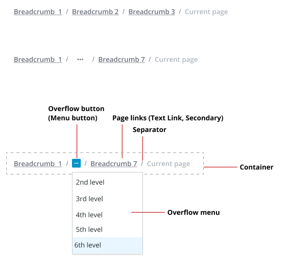

# ptcs-breadcrumb

## Visual



## Overview
A Breadcrumb control shows the current location of the user. It provides a sequence of links to other locations or states.

You can show previously visited locations, or the current location of a user within a website hierarchy.


## Usage Examples

### Basic Usage

In the example, _path_ is an array of strings.

`<ptcs-breadcrumb items="[[path]]"></ptcs-breadcrumb>
`

You can set it using a Polymer data binding, or manually by assigning the property using JavaScript code.


The following code block shows setting up an event listener to navigate using the breadcrumb:

```
document.getElementById(...).addEventListener('ptcs-breadcrumb', ev =>
{
    console.log("Goto step " + ev.detail.index);
});
```

The breadcrumb link width changes dynamically according to the number of links to show, the length of the link text, or window resizing. The links can
be truncated for different reasons:

* Links are truncated to a maximum width of `linkTruncationLength` when `linkTruncation` is set to `true`.
* Links are truncated incrementally if they do not fit within the part `root` container (regardless of `linkTruncation` setting), with a minimum
link width of 34px.
* Although the number of links to show is within the `overflowThreshold` value, the layout will switch to show the breadcrumb with dropdown menu
per the default `overflowThreshold` of 4 (regardless of its actual assigned value), if the truncated links have reached the minimum width yet the breadcrumb still overflows. The layout will revert back to the assigned `overflowThreshold` when possible (e.g. when the breadcrumb fits again thanks to breadcrumb navigation or window resizing).
* Breadcrumbs are truncated incrementally until they fit if property `visibleBoundsTruncation` is set to `true` and the right edge of the rightmost item (breadcrumb link or separator) is not visible. This use case can apply for instance when the breadcrumb is displayed in a flex container.
## Component API

### Properties
| Property                | Type    | Description                                                                                         | Default |
| ----------------------- | ------- | --------------------------------------------------------------------------------------------------- | ------  |
| items                   | Array   | An array of strings, where each string is a step in the breadcrumb path (used as input only)        |  [ ]    |
| disabled                | Boolean | Disables the breadcrumb                                                                             |  false  |
| overflowThreshold       | Number  | Maximum number of breadcrumbs to display before switching to display an overflow dropdown           |  4      |
| selector                | String  | The selector is the key that specifies the entry label when _items_ is a list of objects,           |  " "    |
| selectorUrl             | String  | If items is an array of objects, the selecturUrl should hold the key to the URL to use for each entry| " "    |
| showCurrentLevel        | Boolean | Deprecated. Should the "current" breadcrumb level be shown or not?                                  |         |
| hideCurrentLevel        | Boolean | Hides the current level indicator                                                                   | false   |
| linkTruncation          | Boolean | Truncates long breadcrumbs according to linkTruncationLength (or less)                              | false   |
| linkTruncationLength    | Number  | The maximum width of each breadcrumb when truncated                                                 | 120     |
| visibleBoundsTruncation | Boolean | Truncate breadcrumbs if rightmost item (link or separator) is not visible?                          | false   |

### Events

| Name | Data | Description |
|------|------|-------------|
| ptcs-breadcrumb | ev.detail = { index, item } | Generated when the user clicks on a step in the breadcrumb path. _index_ is the index into the path and _item_ is the item (the step string)|


## Styling

### The Parts of a Breadcrumb

| Part | Description |
|-----------|-------------|
|root|The root of the component|
|body|A container for the list of breadcrumbs and separators|
|link|A ptcs-link breadcrumb entry|
|separator| A container for the forward slash '/' character that separates the crumbs
|dropdown|A ptcs-dropdown list that contains overflow breadcrumb items (when the number of breadcrumbs exceeds the `overflowThreshold` value)|


## ARIA

To be determined

## TODO
- HTML dir attribute
- ARIA attributes (?)
- Support MS File Explorer feature, where each step separator is clickable and allows user to select any substep (?)
- Allow breadcrumb content to consist of arbitrarily complex markup (?)
