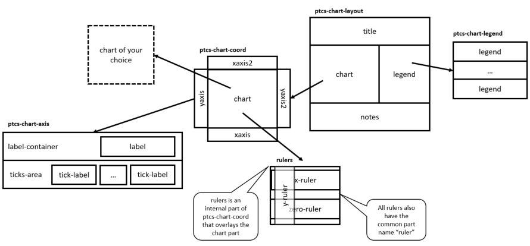

# ptcs-chart

## Overview

`ptcs-chart` is a component ecosystem that enables you to implement data visualization using charts.

The ecosystem consists of three parts:

- _Common components_: Common tasks that can be used by all components
- _Core components_: Components that implement the core functionality of a specific chart type - or types
- _Compound components_: Components that combine common and core components into a single component, for convenient usage

You can use a single compound component, if it meets your requirements, or manually combine common and core components to support more advanced requirements.

### The charting ecosystem

### Common components

- [ptcs-chart-layout](./doc/ptcs-chart-layout.md), for chart layouts
- [ptcs-chart-legend](./doc/ptcs-chart-legend.md), for chart legend
- [ptcs-chart-coord](./doc/ptcs-chart-coord.md),, for combining a chart with a coordinate system (adds axes and rulers)
- [ptcs-chart-axis](./doc/ptcs-chart-axis.md), for chart axes
- [ptcs-chart-zoom](./doc/ptcs-chart-zoom.md), for chart zooming controls

### Core components
- [ptcs-chart-core-bar](./doc/ptcs-chart-core-bar.md), a _bar chart_ component
- [ptcs-chart-core-line](./doc/ptcs-chart-core-line.md), a _line chart_ component, that also implements _area charts_, _scatter plots_ and _streamgraphs_
- [ptcs-chart-core-pareto](./doc/ptcs-chart-core-pareto.md), a _pareto chart_ component
- [ptcs-chart-core-schedule](./doc/ptcs-chart-core-schedule.md), a _schedule chart_ component
- [ptcs-chart-core-waterfall](./doc/ptcs-chart-core-waterfall.md), a _waterfall chart_ component

### Compound components
- [ptcs-chart-bar](./doc/ptcs-chart-bar.md), a complete _bar chart_, with a _layout_, a _coordinate system_ and an _x-_ and _y-axis_
- [ptcs-chart-line](./doc/ptcs-chart-line.md), a complete _line chart_, _area chart_, _scatter plot_ and _streamgraph_
- [ptcs-chart-pareto](./doc/ptcs-chart-pareto.md), a combination of a line and a bar chart that enables you to perform Pareto analysis
- [ptcs-chart-waterfall](./doc/ptcs-chart-waterfall.md), a complete _waterfall chart_ to visualize changes to data
- [ptcs-chart-schedule](./doc/ptcs-chart-schedule.md), a complete _schedule chart_ to visualize schedule data