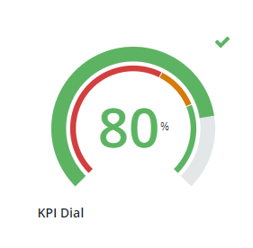

# ptcs-kpi-dial

## Visual

## Overview
The KPI Dial displays a metric's value in context of defined target ranges. The dial can be configured for a traditional, gauge-like layout, or a horizontal/vertical bar layout.

## Usage Examples

### Basic Usage

`<ptcs-kpi-dial layout="horizontal" label="My Label" min-value="10" max-value="20" value="13" unit-of-measure="kg" show-unit-of-measure icon-position="left" valueFormat="0.00" direction="right to left" label-alignment="center"></ptcs-kpi-dial>`

## Component API

### Properties
| Property           | Type    | Description                                                                                                            | Default |
| ------------------ | ------- | ---------------------------------------------------------------------------------------------------------------------- | ------- |
| label              | String  | Specifies the text of the KPI label.                                                                                   | Label   |
| layout             | String  | Controls the type of layout used to display the KPI value. Options: `dial, horizontal, vertical`.                      | dial    |
| value              | Number  | Sets the KPI value.                                                                                                    |         |
| valueFormat        | String  | Sets the format of the KPI value.                                                                                      | 0000    |
| tooltipValueFormat | String  | Sets the format of the KPI value inside the tooltip.                                                                   |         |
| minValue           | Number  | Sets the minimum value to display on the KPI.                                                                          | 0       |
| maxValue           | Number  | Sets the maximum value to display on the KPI.                                                                          | 100     |
| direction          | String  | Specifies the direction of the value tracker on the dial, horizontal, or vertical layouts.                             | dial: `clockwise`, horizontal: `left to right`, vertical: `bottom to top` |
| iconPosition       | String  | Specifies the position of the KPI status icon relative to the value label. Options: `left, center, right`              | left    |
| labelType          | String  | The text type of the KPI label. Options: `caption, body, label, title, large-title, sub-header, header, large-header`. | label   |
| labelAlignment     | String  | Controls the alignment of the KPI's label. Options: `left, center, right`.                                             | left    |
| unitOfMeasure      | String  | Specifies the unit of measurement for the KPI value.                                                                   |         |
| showUnitOfMeasure  | Boolean | Displays the unit of measurement next to the KPI value.                                                                | false   |
| startAngle         | Number  | Sets the start angle of the value and target trackers on the dial layout. Options: `0 - 360`.                          | 45      |
| endAngle           | Number  | Sets the end angle of the value and target trackers on the dial layout. Options: `0 - 360`.                            | 315     |
| stateFormat        | Object  | Defines the KPI target values for the value tracker. It is used to apply a custom icon and color for each value in range.
| maxIconSize        | Number  | Sets the maximum size of the KPI icon. The icon grows or shrinks relative to the size of the container                 |         |

### Events

| Name  | Description                                                                                                                                    |
|-------|------------------------------------------------------------------------------------------------------------------------------------------------|
| click | A click event that is generated when the user clicks on the KPI Dial using the mouse, or by pressing on the Space/Enter keys while in focus.   |

## Styling

### The Parts of a KPI Dial

| Part                  | Description                                                                            |
|-----------------------|----------------------------------------------------------------------------------------|
| root                  | The root element that conatins the KPI value and trackers.                             |
| label                 | The KPI label.                                                                         |
| value-ctr             | The container of the KPI value.                                                        |
| value                 | The value label.                                                                       |
| UOM                   | The unitOfMeasure label.                                                               |
| value-tracker         | The background bar for the maximum value.                                              |
| value-tracker-filling | The value bar display, filling the area up to the value's percentage.                  |
| target-range-tracker  | A smaller bar that shows target ranges with formatting.                                |
| icon                  | The KPI icon according to the stateFormat.                                             |
