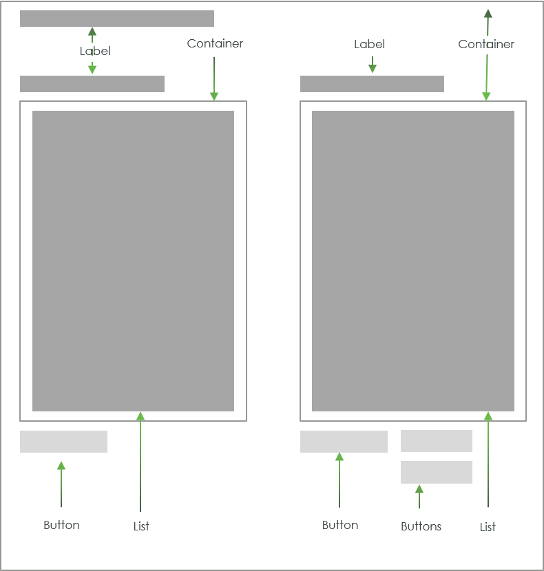

# ptcs-list-shuttle

## Visual

## Overview

A ptcs-list-shuttle allows the user to select items from a source list and move it to a target list, where the items can be rearranged. Items in the target list can be moved back to the source list.

The list-shuttle supports both single and multiple selection mode. The source-list can be filtered.

## Usage Examples

### Basic Usage

~~~html
<ptcs-list-shuttle items="[[itemsIn]]" selected-items="[[itemsOut]]></ptcs-list>
~~~

### Single selection list shuttle

~~~html
<ptcs-list single-select ...></ptcs-list>
~~~

### List shuttle that hides the search filter

~~~html
<ptcs-list hide-filter ...></ptcs-list>
~~~

## Component API

### Properties
| Property                | Type    | Description                                                                              | Default             | Triggers a changed event? |
| ----------------------- | ------- | ---------------------------------------------------------------------------------------- | -------------------- | ------------------------ |
| addLabel                | String  | Label for the add button                                                                 | "Add"                |                          |
| disabled                | Boolean | Is the list-shuttle disabled?                                                            | false                |                          |
| hideFilter              | Boolean | Hide the source-list search filter?                                                      |                      |                          |
| idSelector              | Any     | Selects a string from each item in _items_ as the identifier for each list item. If _unassigned_, the 'selector' acts as the identifier. If a _string_ then items should be an array of objects, where idSelector specifies the (string) property to use as a unique identifier. If a _function_, then the function is called with each item and should return a string that represents the item | |  |
| items                   | Array   | A Javascript array with the list data.                                                   | [ ]                  |                          |
| label                   | String  | Title label for the list shuttle                                                         | ""                   |                          |
| labelAlignment          | String  | Alignment of the "main" label.possible options are 'left', 'center' and 'right'.         | "left"               |                          |
| labelType               | String  | Variant to use for the "main" label. possible options are 'label', 'header', 'sub-header', and 'body'.| "label" |                          |
| labelUp                 | String  | Label for the move up button                                                             | "Up"                 |                          |
| labelDown               | String  | Label for the move down button                                                           | "Down"               |                          |
| removeLabel             | String  | Label for the remove button                                                              | "Remove"             |                          |
| selectedItems           | Array   | The subset of the items in `items` that occurs in the target list                        | [ ]                  | Yes                      |
| selector                | Any     | Selects a string from each item in _items_ to be displayed as the list item label. If _unassigned_, items should be an array of strings. If a _string_ then items should be an array of objects, where selector specifies the (string) property to display. If a _function_, then the function is called with each item and should return a string that represents the item | | |
| singleSelect            | Boolean | Use single (true) or multiple (false) selection mode in the lists?                       | false                |                          |
| selectAllLabel          | String  | Label for selecting all of the source / target list items                                | "Select All"         |                          |
| clearSelectedItemsLabel | String  | Label for clearing the source / target list items selection                              |"Clear Selected Items"|                          |
| sourceLabel             | String  | Label for the source list                                                                | "Source"             |                          |
| sourceLabelAlignment    | String  | Alignment of the source list label. possible options are 'left', 'center' and 'right'.   | "left"               |                          |
| sourceLabelType         | String  | Variant to use for the label above the source list. possible options are 'label', 'header', 'sub-header', and 'body'.|"label"|             |
| sourceFilter            | String  | The current text in the source-list search filter.                                       | ""                   | Yes                      |
| targetLabel             | String  | Label for the target list                                                                | "Target"             |                          |
| targetLabelType         | String  | Variant to use for the label above the target list. possible options are 'label', 'header', 'sub-header', and 'body'.|label|               |
| targetLabelAlignment    | String  | Alignment of the target list label. possible options are 'left', 'center' and 'right'.   | "left"               |                          |
| externalValidity              | String   | The component's validity as determined externally (server-side). Value: `undefined`, `unvalidated`, `invalid`, or `valid` || No    |
| required                      | Boolean  | If true, the target list must contain at least one item.                                      |  false   | No                      |
| requiredMessage               | String   | The message to display when required target list item(s) is missing.                          |          | No                      |
| targetListMaxItems            | Number   | The maximum number of target list items.                                                      |          | No                      |
| targetListMaxItemsFailureMessage | String   | The error message when the number of target item(s) exceeds limit `targetListMaxItems`.    |          | No                      |
| targetListMinItems            | Number   | The minimum number of target list items.                                                      |          | No                      |
| targetListMinItemsFailureMessage | String   | The error message when the number of target item(s) is less than `targetListMinItems`.     |          | No                      |
| hideValidationCriteria        | Boolean  | Don't show a hint message about the required selection in unvalidated state?                  | false    |                         |
| hideValidationError           | Boolean  | Don't show a failure message when the validation failed?                                      | false    |                         |
| hideValidationSuccess         | Boolean  | Don't show a success message when the validation is successful?                               | false    |                         |
| validationCriteria            | String   | A secondary message that displays more information about the validation failure/criteria message.|       |                         |
| validationCriteriaIcon        | String   | An icon to display within the criteria status message (unvalidated).                    | "cds:icon_info"|                         |
| validationErrorIcon           | String   | An icon to display within the status message when the validation fails (invalid).       |"cds:icon_error"| No                      |
| validationOutput              | String   | Reflects the internal validition (Value: `undefined`, `unvalidated`, `invalid`, or `valid`) || Yes                 |
| validationMessage             | String   | The validation (title) message to display when the validation is in `invalid` state.          |          | No                      |
| validationSuccessDetails      | String   | A secondary message that displays more information about the validation success message.      |          |                         |
| validationSuccessIcon         | String   | An icon to display within the status message when the validation succeeds (valid).    |"cds:icon_success"|                         |
| validationSuccessMessage      | String   | The message (title) to display when the validation is successful.                             |          |                         |

## Styling

### State attributes

| Attribute | Description                                                                                                          | Part  |
| --------- | -------------------------------------------------------------------------------------------------------------------- | ----- |
| disabled  |Is list-shuttle disabled?                                                                                             | :host |
| vertical  |Is the list-shuttle in vertical mode (lists stacked on top of each other) or in horizontal mode (lists side-by-side)? | :host |

### Parts

| Part                  | Description                                                         |
| --------------------- | ------------------------------------------------------------------- |
| add-button            | The add button                                                      |
| button                | Part name used on all buttons                                       |
| buttons               | Button container (= `source-buttons` and `target-buttons`)          |
| down-button           | The down button                                                     |
| head                  | Container for the title label                                       |
| label                 | The shuttle title label                                             |
| remove-button         | The remove button                                                   |
| source-buttons        | Container for the button associated to the source list              |
| source-list           | The source list                                                     |
| source-list-parent    | Container for the source list (previously 'source-list-container')  |
| target-buttons        | Container for the buttons associated to the target list             |
| target-list           | The target list                                                     |
| target-list-parent    | Container for the target list (previously 'target-list-container')  |
| up-button             | The up button                                                       |

Note: A part name collision of the imported source and target lists has caused a part name change. The list has a part `list-container` and the part import
process adds a _prefix_ to imported list parts (`source-` and `target-`, respectively), causing a clash with the earlier ptcs-list-shuttle part names for the
list containers.