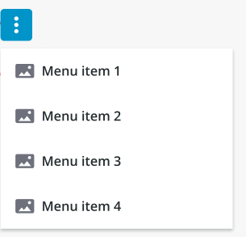

# ptcs-menu-button

## Visual



## Overview

A menu button is a button that opens a menu.

## Usage Examples

### Basic Usage

```html
<ptcs-menu-button items="[[items]]"></ptcs-menu-button>
```

## Component API

### Properties

| Property            | Type    | Description                                                                                                  |  Default                                  | Triggers a changed event? |
| ------------------- | ------- | ------------------------------------------------------------------------------------------------------------ | ----------------------------------------- | ------------------------- |
| disabled            | Boolean | Disables the button                                                                                          | false                                     | No                        |
| offset              | Number  | The distance between the button and the menu edge.                                                           | 8                                         | No                        |
| openOnHover         | Boolean | Determines whether hovering the button will trigger the menu.                                                | false                                     | No                        |
| buttonVariant       | String  | Set a button variant.                                                                                        | "tertiary"                                | No                        |
| menuPopupClass      | String  | Sets a custom `class` attribute value to style popup menus (see below).                                                               |                                            | No                        |
| icon                | String  | Sets an icon.                                                                                                | "cds:icon_more_vertical"                  | No                        |
| iconSrc             | String  | Sets an icon source.                                                                                         |                                           | No                        |
| contentAlign        | String  | Align the label in button to the left, right or center.                                                      | "center"                                  | No                        |
| buttonMaxWidth      | Number  | Set a maximum width for the button widget.                                                                   |                                           | No                        |
| label               | String  | The text label in button.                                                                                    |                                           | No                        |
| tooltip             | String  | The tooltip that appears when hovering over the button                                                       |                                           | No                        |
| tooltipIcon         | String  | The icon for the tooltip                                                                                     |                                           | No                        |
| displayIcons        | Boolean | When false, icon data is ignored by the menu, and no icons are rendered.                                     | false                                     | No                        |
| allowMissingIcons   | Boolean | When allowMissingIcons is false, and displayIcons is true, a default icon will be assigned to any Menu Item that has no icon data associated with it.|false| No                      |
| menuMaxWidth        | String  | Sets the maximum width the menu can be reduced to. May be defined by a custom value, in pixels. If set to "auto", the menu will assume the width of its widest menu item.  |"auto"|No|
| menuMinWidth     | String  | Sets the minimum width the menu can be reduced to. May be defined by a custom value, in pixels. If set to "auto", the menu will not become narrower than its widest menu item.|"auto"|No|
| maxMenuItems        | String  | Defines the maximum number of visible dropdown menu and submenu items.                                       | 5                                         | No                        |
| iconPlacement       | String  | Sets the tooltip icon image on the left or right of the text label if there is any.                          | "right"                                   | No                        |
| menuPlacement       | String  | Sets the placement of the menu in relation to its button. The property lets you choose to place the menu on the top/bottom(vertically) or left/right(horizontally) of the button. The exact alignment of the menu will be auto adjusted based on the menu button’s position on the page. Options: "vertical" / "horizontal".         | "vertical"                                | No                        |
| menuIconSize        | Number  | Setting the size will set the width and the height of the icon                                               |                                           | No                        |


### Custom Class Styling

Components that use the submenu flyovers (such as the `ptcs-menubar`) may have a custom styling clash because the flyovers are added as `ptcs-menu-submenu` elements under the document `body`, making it harder to style these items _differently_ when coming from different components. The `menuPopupClass` property simplifies styling customization of the flyovers: The submenu items use CSS variables for styling, so their value can be set from a single class-based rule off `ptcs-menu-submenu`, such as:

```html
    ptcs-menu-submenu.purple {
      --ptcs-menu-button--menu-background: #dec8fa;
      --ptcs-menu-button--item-background: #dec8fa;
      --ptcs-menu-button--item-background-hover: #c493ff;
      --ptcs-menu-button--item-background-selected: #9e57f5;
      --ptcs-menu-button--item-background-pressed: #b489e9;
    }
```

The following CSS variables are currently declared for `ptcs-menu-button` styling:

* `--ptcs-menu-button--menu-background`
* `--ptcs-menu-button--item-font-family`
* `--ptcs-menu-button--item-font-weight`
* `--ptcs-menu-button--item-font-style`
* `--ptcs-menu-button--item-font-size`
* `--ptcs-menu-button--item-font-decoration`
* `--ptcs-menu-button--item-color`
* `--ptcs-menu-button--item-background-hover`
* `--ptcs-menu-button--item-font-family-hover`
* `--ptcs-menu-button--item-font-weight-hover`
* `--ptcs-menu-button--item-font-style-hover`
* `--ptcs-menu-button--item-font-size-hover`
* `--ptcs-menu-button--item-font-decoration-hover`
* `--ptcs-menu-button--item-color-hover`
* `--ptcs-menu-button--item-background-selected`
* `--ptcs-menu-button--item-font-family-selected`
* `--ptcs-menu-button--item-font-weight-selected`
* `--ptcs-menu-button--item-font-style-selected`
* `--ptcs-menu-button--item-font-size-selected`
* `--ptcs-menu-button--item-font-decoration-selected`
* `--ptcs-menu-button--item-color-selected`
* `--ptcs-menu-button--item-background-pressed`
* `--ptcs-menu-button--item-font-family-pressed`
* `--ptcs-menu-button--item-font-weight-pressed`
* `--ptcs-menu-button--item-font-style-pressed`
* `--ptcs-menu-button--item-font-size-pressed`
* `--ptcs-menu-button--item-font-decoration-pressed`
* `--ptcs-menu-button--item-color-pressed`
* `--ptcs-menu-button--item-background-disabled`
* `--ptcs-menu-button--item-font-family-disabled`
* `--ptcs-menu-button--item-font-weight-disabled`
* `--ptcs-menu-button--item-font-style-disabled`
* `--ptcs-menu-button--item-font-size-disabled`
* `--ptcs-menu-button--item-font-decoration-disabled`
* `--ptcs-menu-button--item-color-disabled`


### Events

| Name             | Data                   | Description                                                                            |
| ---------------- | ---------------------- | -------------------------------------------------------------------------------------- |
| `action`         | `ev.detail = { item }` | Generated when the user clicks on a "leaf" in the menu tree (an item without a submenu)|
| `button-clicked` |                        | Generated when there are no menu items and the user clicks the button                  |
