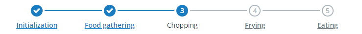

# ptcs-progress-tracker

## Visual



## Overview
A progress tracker control shows a linear sequence of steps. Steps can be marked as completed, either by user interaction or programatically.

## Usage Examples

### Basic Usage

In the example, _steps_ is an array of objects.

`<ptcs-progress-tracker steps="[[array]]"></ptcs-progress-tracker>`

You can set it using a data binding, or manually by assigning the property using JavaScript code.

The following code block shows how to set up an event listener to be notified whenever a step has been clicked/selected:

```
document.getElementById(...).addEventListener('step-clicked', ev => {
    const selectedData = ev.detail.selectedData;
    console.log(`Click on step ${selectedData.stepNumber}`);
});
```

The Progress tracker is built from an array of objects. For each object in the steps array, the component will look at the following properties when creating the component:

* `stepNumber` is an integer used to order the steps. The steps are _sorted_ by this value before they are displayed.
* `stepLabel` is the string displayed in the label below the step.
* `stepState` defines the _state_ of the step (inactive, active, completed, or error).
* `isInteractive` defines if the step itself should be interactive/clickable. 

## Component API

### Properties
| Property           | Type    | Description                                                                                            | Default |
| ------------------ | ------- | ------------------------------------------------------------------------------------------------------ | ------- |
| steps              | Array   | An array of objects, where each object is a step in the Progress tracker step sequence.                |  [ ]    |
| currentStepNumber  | Number  | The step number of the currently selected step.                                                        |         |
| selectedData       | Object  | The object in the _steps_ array corresponding the currently selected step.                             |         |
| isInteractive      | Boolean | Should the entire Progress tracker be inactive? This overrides any properties on the individual steps. | true    |
| stepSize           | String  | Size of the steps ('small', 'medium' or 'large').                                                      | 'medium' |
| minPipeLength      | Number  | Minmum length (in px) of the 'pipe' separator between the steps. Minimum allowed value is 60.          | 90      |
| completedStepIcon  | String  | Icon used for a _completed_ step.                                                                      | 'cds:icon_ok_mini' |
| noDataText         | String  | Text displayed when no input data has been passed.                                                     | 'No steps.' |
| noDataIcon         | String  | Icon displayed when no input data has been passed.                                                     | 'cds:icon_not_visible' |
| noBindingText      | String  | Text displayed when the input data was empty.                                                          | 'No data to display.' |
| noBindingIcon      | String  | Icon displayed when the input data was empty.                                                          | 'cds:icon_bind' |
| errorStateText     | String  | Text displayed when the input data is flawed.                                                          | 'Unable to load data.' |
| errorStateIcon     | String  | Icon displayed when the input data is flawed.                                                          | 'cds:icon_error'|

### Events

| Name | Data | Description |
|------|------|-------------|
| step-clicked | ev.detail.selectedData | Generated when the user clicks on a step in the Progress tracker. _selectedData_ is the object in the _steps_ array that corresponds to the step that was clicked. |

## Styling

### The Parts of a Progress tracker

| Part            | Description                                                             |
|-----------------|-------------------------------------------------------------------------|
| root            | The root element of the Progress tracker component.                     |
| step-container  | Element containing all step elements                                    |
| step            | Contains an individual step.                                            |
| step-icon       | The icon displaying the state of a step.                                |
| step-number     | The number of an inactive step.                                         |
| step-label      | The label (or link, if interactive) displayed below each step (if any). |
| pipe            | The divider between each step.                                          |
| error-container | Container element for the error state/label                             |
| error-state     | Icon displayed when no/empty/bad indata was passed.                     |
| error-label     | Label displayed when no/empty/bad indata was passed.                    |

