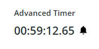

# ptcs-timer

## Visual

## Overview
The Timer displays counting value. One can control its state (running/stop), its format display (days and/or milliseconds), and its styles.

The _ptcs-timer_ has two different counting modes:
* stopwatch - counting up.
* countdown - counting down, towards zero.

## Usage Examples

### Basic Usage

`<ptcs-timer></ptcs-timer>`

## Component API

### Properties
| Property               | Type    | Description                                                                                                                    | Default    |
| ------------------     | ------- | ------------------------------------------------------------------------------------------------------------------------------ | ---------- |
| label                  | String  | Specifies the text of the Timer label.                                                                                         |            |
| labelType              | String  | The label text type of the Timer label. Options: `caption, body, label, title, large-title, sub-header, header, large-header`. | label      |
| labelAlignment         | String  | Controls the alignment of the Timer label. Options: `left, center, right`.                                                     | left       |
| valueLabelType         | String  | The label text type of the timer value. Options: `caption, body, label, title, large-title, sub-header, header, large-header`. | sub-header |
| icon                   | String  | Sets an icon image for the timer.                                                                                              |            |
| iconSize               | Number  | Specifies the width and height of the icon in pixels.                                                                          | 16         |
| iconAlignment          | String  | Sets the alignment of the icon relative to the timer value. Options: `left, right`.                                            | right      |
| alternateIcon          | String  | Sets an alternate icon image for the timer.                                                                                    |            |
| alternateIconSize      | Number  | Specifies the width and height of the alternate icon in pixels.                                                                | 16         |
| alternateIconAlignment | String  | Sets the alignment of the alternate icon relative to the timer value. Options: `left, right`.                                  | right      |
| alternateStyle         | Boolean | Sets the timer to an alternate state using alternate styling and an alternate icon.                                            | false      |
| horizontalAlignment    | String  | Sets the Timer value and icon alignment. Options: `left, center, right`.                                                       | left       |
| initialValue           | Number  | The Timer initial Value in milliseconds. On reset, the Timer value sets to initialValue.                                       |            |
| running                | Boolean | Sets the Timer state. Options: `true (run), false (stop)`.                                                                     | true       |
| timerMode              | String  | Sets the Timer counting mode. Options: `stopwatch, countdown`.                                                                 | stopwatch  |
| displayDays            | Boolean | Displays days next to hours, minutes, and seconds in the formatted time value when the value runs over 24 hours.               | true       |
| displayMilliseconds    | Boolean | Displays milliseconds in the formatted time value.                                                                             | false      |
| value                  | Number  | The current timer duration in milliseconds.                                                                                    |            |

### Methods

| Method     | Arguments    | Description                                                         |
| ---------- | ------------ | ------------------------------------------------------------------- |
| reset      | none         | Resets the timer back to the default value set using initialValue.  |

### Events

| Name                | Data              | Description                                                          |
| ------------------- | ----------------- | -------------------------------------------------------------------- |
| value-changed       | { value: Number } | Updating the current timer value in milliseconds.                     |
| countdown-completed | String            | In Countdown mode only, triggered when the timer value reaches zero. |

## Styling

### Parts

| Part                  | Description                                                |
|-----------------------|----------------------------------------------------------- |
| label                 | The Timer label.                                           |
| value-ctr             | The container of the Timer value.                          |
| value                 | The value label.                                           |
| icon                  | The Timer value icon.                                      |
