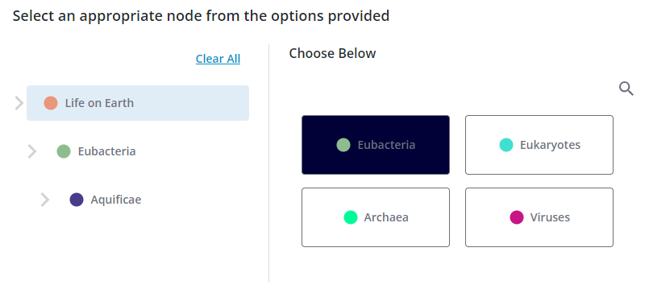

# ptcs-tree-selector

## Visual



## Overview
A Tree Selector is a component for selecting a single node from a hierarchical tree structure.

Each node may have child nodes, these are displayed in a grid-like sequence in the right section of the component. The parent hierarchy of the current node
is displayed to the left. You move deeper into the data by selecting nodes to the right, the current context is shown in the hierarchy list on the left. There is also an option to search the data.

## Usage Examples

### Basic Usage

```
<ptcs-tree-selector data="..."></ptcs-tree-selector>
```

The Javascript object passed as `data` to the component is an array containing all top-level nodes. Each of these nodes uses three fixed properties:

* `name` is a string containing the name of the node, displayed in the corresponding buttons in the Tree selector.
* `color` is used in the indicator icon, also displayed in the buttons. If omitted, a default color will be used.
* `contents` is an array containing the child nodes of the node

As the user clicks his way through the nodes in the structure, an `action` event is triggered every time a node is selected. This contains the full object of the node, so any data can be attached to the object and be retrieved, we are not limited to just strings.

## Component API

### Properties
| Property           | Type    | Description                                                                                            | Default |
| ------------------ | ------- | ------------------------------------------------------------------------------------------------------ | ------- |
|data|Array|The hierarchical data that the component displays. The `name`, `color`, and `contents` properties are read and interpreted to build the component contents (see above).||
|disabled|Boolean|Disables the component.|false|
|preselectedNode|String|The name of one of the nodes that should initially be displayed as selected. If not present, the selector will display the root node.||
|disableSearch|Boolean|Should the "open search" button be displayed?|false|
|noSelectionMessage|String|Message displayed in the hierarchical section if nothing has been selected.|'Select an item from the tree.'|
|noSelectionIcon|String|Icon associated with the `noSelectionMessage`.|'cds:icon_not_visible'|
|noSearchResultMessage|String|Message displayed in the search hit section when the search resulted in no hits.|'No results.'|
|noSearchResultIcon|String|Icon associated with the `noSearchResultMessage`.|'cds:icon_not_visible'|
|titleLabel|String|Label displayed at the top of the component|'Choose Below'|
|selectionLabel|String|Label displayed above the nodes section.|'No results.'|
|typeDelay|Number|When focusing on nodes in the node list by typing a character, this specifies the time gap within which two consecutive keystrokes should be considered part of the same search word |500ms|
|clearSelectionLabel|String|Label of the Clear selection button.|'Clear Selection'|

### Events

| Name | Data | Description |
|------|------|-------------|
|action|detail: {item: node}|Triggered every time the user selects a node. The `detail.item` value holds the javascript object of the clicked node.| 

### Methods

| Signature | Description |
|-----------|-------------|
|selectNode(text)|Select the node with a given name (if any)|

## Styling

### The Parts of a Tree Selector

| Part            | Description                                                             |
|-----------------|-------------------------------------------------------------------------|
|`root`|Root part of the entire Tree Selector component|
|`main-label`|The ptcs-label displayed at the top of the component|
|`main`|Parent part of the `hierarchy-root`, `divider`, and `node-root` parts|
|`hierarchy-root`|Parent part of the hierarchy section and its header|
|`header`|Parent part of the Clear Selection button|
|`clear-selection`|The ptcs-button ('Clear Selection') on top of the hierarchy list|
|`hierarchy`|Parent part of the hierarchy section|
|`parent`|Parent part of a `parent-marker` and a `parent-node`|
|`parent-marker`|The ptcs-icon displayed to the left of each `parent-node` part|
|`parent-node`|The ptcs-button of each entry in the hierarchy list|
|`no-selection`|Parent part of the `no-selection-icon` and `no-selection-label` parts|
|`no-selection-icon`|The ptcs-icon displayed next to the 'No Selection.' message|
|`no-selection-label`|The ptcs-label displayed in the hierarchy section when nothing has yet been selected ('No Selection.')|
|`divider`|The vertical ptcs-divider displayed between the hierarchy and nodes/search sections|
|`node-root`|Part that contains all parts in the nodes/search sections|
|`search-header`|Part containing the `search-label` and `open-search` parts|
|`search-label`|The ptcs-label displayed above the nodes part|
|`open-search`|The ptcs-button that opens the search section|
|`nodes`|Part containing all child nodes of the current node|
|`node`|The ptcs-button used to display the name and a color icon for a child node|
|`nothing-to-select`|Parent part of the `nothing-to-select-icon` and `nothing-to-select-label` parts when there are no more nodes to select.|
|`nothing-to-select-icon`|The ptcs-icon displayed in the node section next to the 'End of Selection.' message when there are no more nodes to select.|
|`nothing-to-select-label`|The ptcs-label displaying the 'End of Selection.' message when there are no more nodes to select.|
|`search`|Part containing all search-related parts|
|`close-search`|The ptcs-button that closes the search section|
|`search-field`|The ptcs-textfield wher the user enters a search text|
|`search-hits`|Part containing all the hits|
|`hit`|Parent part of a search hit|
|`hit-node`|The ptcs-button that displays a search hit|
|`no-search-result`|Parent part of the `no-search-result-icon` and the `no-search-result-label`|
|`no-search-result-icon`|The ptcs-icon displayed next to the 'No results.' message|
|`no-search-result-label`|The ptcs-label that displays the 'No results.' message|
|`recent`|Parent part of the recent list|
|`recent-list`|The ptcs-list that displays the five latest searches|
